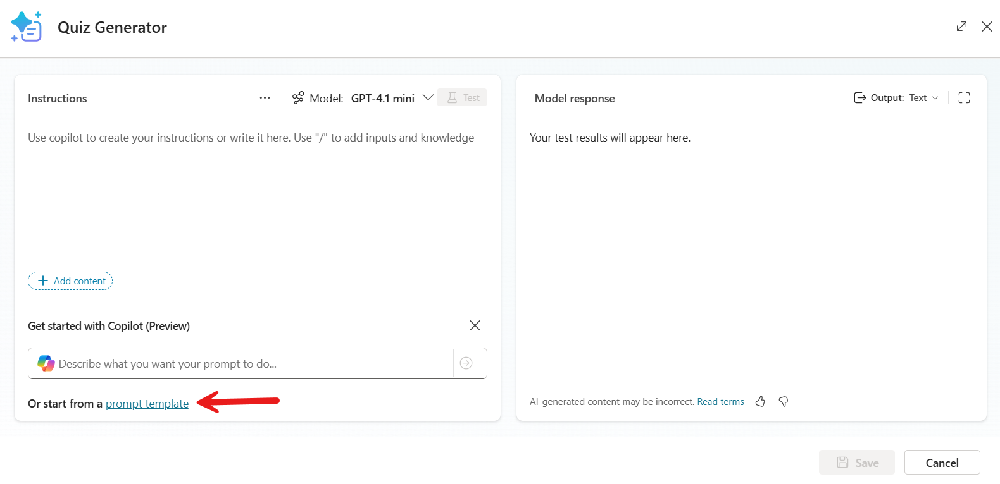

# Lab 02 - Build an agent with Copilot Studio

In this lab, you will go through the following tasks:

- Add Dataverse as a knowledge source
- Add a website as a knowledge source
- Use adaptive cards to make your agent look nicer
- Enrich your agent with AI Prompts

## 📊 Add Dataverse as a knowledge source - Dataverse entity suppliers / data excel file (Mats)

## 🌐 Add a website as a knowledge source - Microsoft Learn (Mats)

## 🎨 Use adaptive cards to make your agent look nicer

Now lets make sure the users of our agent can ask for content - and lets use a different option here. Instead of using knowledge, we will create a topic with an adaptive card. The adaptive card will be used to make sure not only text is shown, but also a bit of design is shown.

In this part of the lab, we will add a topic called Devices. In this topic, we will get items from a SharePoint list and return them in an adaptive card. This will make your agent look way better. ✨

Let's start by creating a topic:

1. Select **Add a topic** and then **From blank**

    

1. Change the topic name from _Untitled_ to **Devices**
1. Paste the following text under **Describe what the topic does**

    ```text
    This topic helps you discover available devices in your organization's inventory by browsing through the complete catalog. You can easily filter devices by type—whether you're looking for desktops, tablets, or laptops—to quickly narrow down your search. Simply ask what devices are available or specify the type you need, and the chatbot will show you matching options with relevant details.
    ```

1. Select the **Save** button to save the topic

    Next, we will create a connector tool to get the items from SharePoint.

1. Below the trigger select the **+** icon to add a new node, select **Add a tool**, select **Connector**, search for **Get items**, and select the **Get items** tool from SharePoint
1. Select **Not connected** and select **Create new connection**

    

1. Select **Create** to create the connection
1. Pick your account from the sign in screen
1. Select **Submit**

    The connector tool will get added to the canvas now.

    

1. Select **Site Address** under _Inputs_

    

    This will open a sidebar with configuration options for the inputs.

    

1. Select the **dropdown menu** under _Site Address_, select **Enter custom value** and paste the following address:

    ```text
    https://ppcc25workshop01.sharepoint.com/sites/IT/
    ```

    

1. Select the **dropdown menu** under _List name_ and select **Devices**

    

1. Close the sidebar by selecting the **X** on the top right

    We have now configured the connector tool to get all devices in the SharePoint list, but we want to filter on type of devices. Lets get that working now!

1. Select the **+** above the _Get items_ node
1. Select **Add a question**
1. Enter the following question in the text box

    ```text
    What type of device are you looking for?
    ```

    

1. Select **New option** under _Options for user_
1. Enter **Desktop** in the input box that appears
1. Add two options for **Tablet** and **Laptop** too

    

1. Select **Var1**

    This will open a sidebar where you can change the name of the variable
1. Change the name of the variable to **VarDeviceType**
1. Close the sidebar by selecting **X**
1. Next, remove the conditions for **Desktop**, **Tablet** and **Laptop** by selecting **...** and **Delete**

    The nodes below the trigger in your topic should look like this now:

    

    Next, we want to make sure the SharePoint connector tool should filter on the choice the user made in the question.

1. Select the **+** icon above the _Get Items_ node, select **Variable management** and select **Set a variable value**

    

1. Select **Select a variable** under _Set Variable_ and select **Create a new variable**
1. Select **Var1** and rename it to **VarFilter**
1. Select **...**, select **Formula** and enter the following formula in the _fx_ input:

    ```text
    Concatenate("Status eq 'Available' and AssetType eq '", Topic.VarDeviceType, "'")
    ```

1. Select **Submit**

    

1. Select **Site Address** again under _Inputs_
1. Select **...** under _Filter Query_ and then select **VarFilter**

    

## ✨ Enrich your agent with AI Prompts

There is a lot of content available in our agent now, but we haven't shown one of the hidden gems of Copilot Studio yet: AI Prompts!

Tools can be used to extend the capabilities of agents. You can add multiple types of tools to your agents in Microsoft Copilot Studio:

- **Prebuilt connector action**, which use Power Platform connectors to access data from other systems, such as popular enterprise products like Salesforce, Zendesk, MailChimp, and GitHub.
- **Custom connector action**, where a connector can be built to access data from public or private APIs.
- **Power Automate cloud flow**, which use Power Automate cloud flows to perform actions, retrieve and work with data.
- **AI Builder prompts**, which use AI Builder and natural language understanding to target the specific scenarios and workflows within your business.
- **Bot Framework skill**, which use the skill manifest that outlines the actions the skill can perform, including its input and output parameters, the skill's endpoints, and dispatch models for the skill.

### Add an AI prompt to a topic

In this part of the lab we’ll be creating a **AI prompt** in a topic.

Prompt tools in topics help guide the agent's response in a semi-scripted conversation by using the generative AI models from AI Builder and natural language understanding to address specific scenarios for your agents.

For this lab, we'll add a Topic that calls a prompt action to generate questions for a quiz.

1. In your agent select the **Topics** tab, select **+ Add a topic** and select **From blank**.

    

1. Enter a **name** for the Topic such as `Generate questions for a quiz` and enter the text below under **Describe what the topic does**

    ```text
    This topic covers creating interactive quizzes based on a chosen subject. It generates a set number of questions and formats them according to given instructions. The goal is to produce well-structured, engaging quizzes that match the topic and layout preferences.
    ```  

    

1. Select **Save** on the top right of the authoring canvas to save the Topic.

    

1. Under the trigger node, select the **+** icon and select the **Add a tool** node, followed by selecting **New prompt**.

    

1. Let's take a moment to familiarize ourselves with the Prompt dialog. You’ll see the following:
    - **Name** of the prompt on the top left
    - **Instructions** on the top left hand side which is where you can enter your prompt. You can also start by using the suggested prompts, and test the prompt.
    - **...** on the right side of _Instructions_. Here you can find Clear prompts (to clear your prompt), Prompt library (a set of prompts you can use as templates) and _Settings_ (which can give you a lot more options for your prompt).
    - **Get started with Copilot (Preview)** on the bottom of the _Instructions_. This is where you can get help creating your prompt. Making a good prompt is an art, and using Copilot for help is not a shame. Try it out later!
    - **Start from a prompt template** on the bottom of _Get started with Copilot (Preview)_. This is where you can find a bunch of templates so that you don't have to reinvent the wheel.
    - **Model** on the right side of the _..._. Here you can select one of the managed models or add a model from Azure AI Foundry.
    - **Model response** on the top right hand side which displays the response generated based on the prompt.
    - **Output** where you define the response to be returned as text, JSON or Document (Preview).

    

1. We'll create prompt that will generate questions for a quiz. Enter a name for the prompt such as `Quiz Generator`

    

1. Instead of creating a custom prompt from scratch, we will start from a prompt template. Select **prompt template** at the bottom.

    

1. Enter **quiz** in the search box and select the **Generate a quiz** prompt.

    

    > [!NOTE]
    > Notice that the prompt automatically gets added to the instructions. It even includes inputs.

    

1. Select the **topic** input and change the value of the sample data from _Art_ to **Power Platform**

    

1. Close the **topic** input and select **Test** and a response to the prompt regarding the values provided in the sample data of the input is returned.

    

    Let's now save the prompt by selecting **Save custom prompt**

    

1. The prompt action node will now appear in the authoring canvas of the Topic. The same three inputs we saw in the instructions in the Prompt Builder are available here: topic, format and number.

    

1. Repeat the same for the remaining input parameters of the prompt action.

    

1. Next, we need to define the output variable of the prompt action. This is so that the response can be referenced downstream in the topic. Select the **>** icon and in the **Custom** tab, select **Create new**

    

1. A new variable named `Var1` appears as the variable output. Select the variable and the variable properties pane will appear. Enter a variable name such as `VarQuizQuestionsResponse`

    

1. Below the Prompt action, select the **+** icon to add a new node and select **Send a message**. Select the **{x}** variable icon.

    

1. Select the variable **VarQuizQuestionsResponse.text**. This will add the text property of the prompt action response to the send a message node.

    

1. Select **Save** to save your topic.

1. The Topic details needs to be updated next which will be used by your agent to associate the topic with the user's intent when [Generative mode](https://learn.microsoft.com/microsoft-copilot-studio/advanced-generative-actions#how-does-generative-mode-work) is enabled. Select **Details** and for the **Display name** enter the following

    ```text
    generate questions for a quiz
    ```

    For the **Description** enter the following

    ```text
    This topic creates questions for a quiz based on the number of questions, the topic and format provided by the user
    ```

    

1. Select **Save** to save your topic.

1. Lastly, the [Generative mode](https://learn.microsoft.com/microsoft-copilot-studio/advanced-generative-actions#how-does-generative-mode-work) setting needs to be enabled for the agent to call the topic with the prompt action. Select **Settings** for your agent.

    

1. Select the **Generative AI** setting and select **Generate (preview)** followed by selecting **Save**.

    

1. Great, we're now ready to test the agent. In the test pane, select the **refresh** icon. Then enter the following question,

    ```text
    Create 5 questions for a quiz based on geography and format the quiz as multi choice
    ```

    

1. A response is returned where 5 questions have been provided with the answers on the topic of geography and is formatted as multi choice questions.

    
